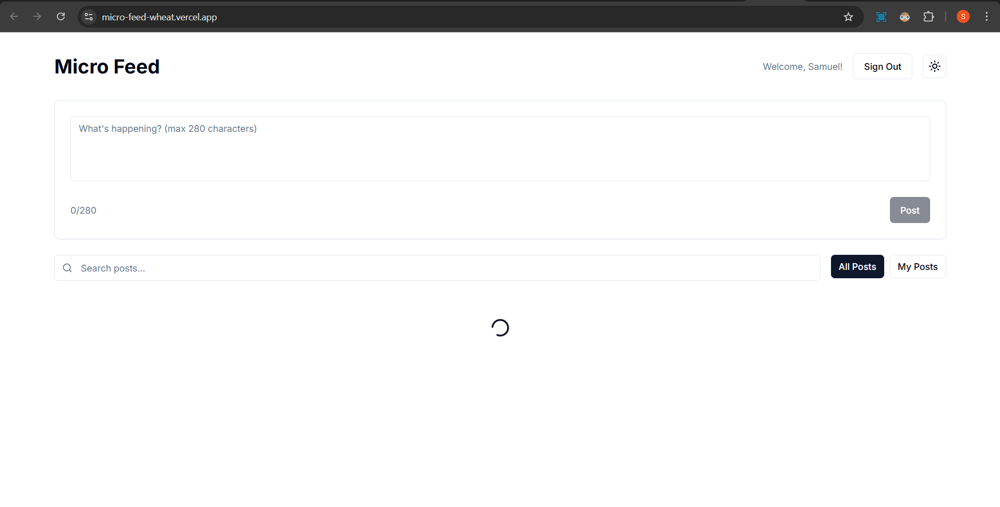
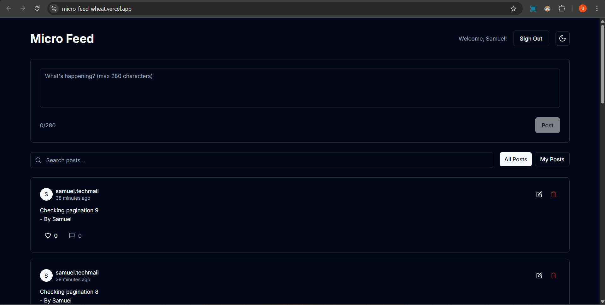

# Micro Feed - Next.js + TypeScript + Supabase

A tiny "micro feed" application where authenticated users can create, read, update, delete, and like posts with a 280-character limit.

# Micro Feed

**Live demo:** [https://micro-feed-wheat.vercel.app/](https://micro-feed-wheat.vercel.app/)




## Features

- ✅ **Authentication**: Sign up, sign in, and sign out with Supabase Auth
- ✅ **Post Management**: Create, read, update, and delete posts (≤280 chars)
- ✅ **Search & Filter**: Search posts by keyword and filter between "all" vs "mine"
- ✅ **Pagination**: Cursor-based pagination for efficient loading
- ✅ **Likes**: Like/unlike posts with optimistic updates
- ✅ **Real-time**: Optimistic UI updates for better user experience
- ✅ **Theme Toggle**: Light/dark mode support with shadcn/ui
- ✅ **Responsive Design**: Mobile-first design with Tailwind CSS

## Tech Stack

- **Frontend**: Next.js 14 (App Router), TypeScript, React 18
- **Styling**: Tailwind CSS, shadcn/ui components
- **Backend**: Supabase (Auth + Database)
- **Validation**: Zod schemas for client and server validation
- **State Management**: React hooks with optimistic updates

## Project Structure

```
├── app/
│   ├── actions/          
│   ├── api/              # Server actions for post operations
│   ├── globals.css       # Global styles and Tailwind imports
│   ├── layout.tsx        # Root layout with theme provider
│   └── page.tsx          # Main feed page
├── components/
│   ├── ui/               # shadcn/ui components
│   ├── composer.tsx      # Post creation component
│   ├── post-card.tsx     # Individual post display
│   ├── search-bar.tsx    # Search functionality
│   └── toolbar.tsx       # Filter and search controls
├── hooks/
│   ├── use-auth.tsx      # Authentication state management
│   ├── use-posts.tsx     # Posts fetching and pagination
│   ├── use-mutate-post.tsx # Post CRUD operations
│   └── use-like.tsx      # Like/unlike functionality
├── lib/
│   ├── db.ts             # Supabase client configuration
│   ├── validators.ts     # Zod validation schemas
│   └── utils.ts          # Utility functions
└── types/
    └── post.ts           # TypeScript type definitions
```

## Setup Instructions

### 1. Prerequisites

- Node.js 18+ and npm/yarn
- Supabase account and project

### 2. Install Dependencies

```bash
npm install
```

### 3. Environment Variables

Copy `env.example` to `.env.local` and fill in your Supabase credentials:

```bash
cp env.example .env.local
```

```env
NEXT_PUBLIC_SUPABASE_URL=your_supabase_project_url
NEXT_PUBLIC_SUPABASE_ANON_KEY=your_supabase_anon_key
```

### 4. Database Setup

Run the following SQL in your Supabase SQL editor:

```sql
-- Create profiles table
create table if not exists profiles (
  id uuid primary key references auth.users(id) on delete cascade,
  username text unique not null,
  created_at timestamptz default now()
);

-- Create posts table
create table if not exists posts (
  id uuid primary key default gen_random_uuid(),
  author_id uuid not null references profiles(id) on delete cascade,
  content text not null check (char_length(content) <= 280),
  created_at timestamptz default now(),
  updated_at timestamptz default now()
);

-- Create likes table
create table if not exists likes (
  post_id uuid references posts(id) on delete cascade,
  user_id uuid references profiles(id) on delete cascade,
  created_at timestamptz default now(),
  primary key (post_id, user_id)
);

-- Enable Row Level Security
alter table profiles enable row level security;
alter table posts enable row level security;
alter table likes enable row level security;

-- Profiles policies
create policy "read profiles" on profiles for select using (true);
create policy "upsert self profile" on profiles
for all using (auth.uid() = id) with check (auth.uid() = id);

-- Posts policies
create policy "read posts" on posts for select using (true);
create policy "insert own posts" on posts for insert with check (auth.uid() = author_id);
create policy "update own posts" on posts for update using (auth.uid() = author_id);
create policy "delete own posts" on posts for delete using (auth.uid() = author_id);

-- Likes policies
create policy "read likes" on likes for select using (true);
create policy "like" on likes for insert with check (auth.uid() = user_id);
create policy "unlike" on likes for delete using (auth.uid() = user_id);
```

### 5. Run Development Server

```bash
npm run dev
```

Open [http://localhost:3000](http://localhost:3000) in your browser.

## Design Notes

### Architecture Choices

**Server Actions vs Route Handlers**: I chose Server Actions for this project because they provide a more integrated experience with Next.js 14, better type safety, and simpler error handling. They also eliminate the need for separate API route files while maintaining the same security and validation benefits.

**Error Handling Strategy**: Comprehensive error handling with user-friendly messages, proper HTTP status codes, and graceful fallbacks. Server-side validation with Zod ensures data integrity, while client-side validation provides immediate feedback.

**Optimistic Updates**: Implemented for likes and post creation to provide instant feedback. The UI updates immediately, then syncs with the server. If an error occurs, the optimistic update is reverted, ensuring consistency.

**RLS Assumptions**: Row Level Security is configured to allow users to read all posts but only modify their own. The application assumes that authenticated users have valid profiles and that the database schema matches the expected structure.

### Trade-offs and Timeboxing

**What I Skipped and Why**:

1. **Real-time subscriptions**: While Supabase supports real-time updates, I focused on the core CRUD functionality and optimistic updates for better performance.

2. **Advanced search**: Implemented basic text search but skipped full-text search, filters by date, or complex query building to keep the scope manageable.

3. **Image uploads**: Focused on text-only posts to maintain the "micro" nature and simplify the implementation.

4. **User profiles**: Basic username display but skipped profile pictures, bio, or user settings to focus on the core feed functionality.

5. **Comments system**: Added comment count display but skipped the actual commenting functionality to keep the scope focused.

**Time Allocation**: 
- Core functionality (70%): Authentication, CRUD operations, likes
- UI/UX (20%): Responsive design, theme toggle, shadcn/ui components
- Polish (10%): Error handling, loading states, optimistic updates

## API Endpoints

The application uses Server Actions instead of traditional API routes:

- `createPost(data)`: Create a new post
- `updatePost(id, data)`: Update an existing post
- `deletePost(id)`: Delete a post
- `toggleLike(postId)`: Toggle like/unlike on a post

## Contributing

1. Fork the repository
2. Create a feature branch
3. Make your changes
4. Add tests if applicable
5. Submit a pull request

## License

MIT License - feel free to use this project for learning or commercial purposes.
